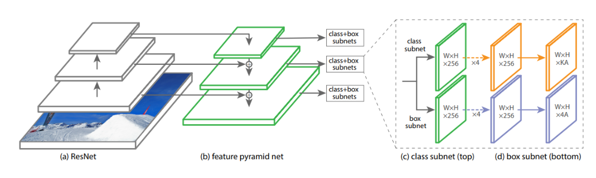
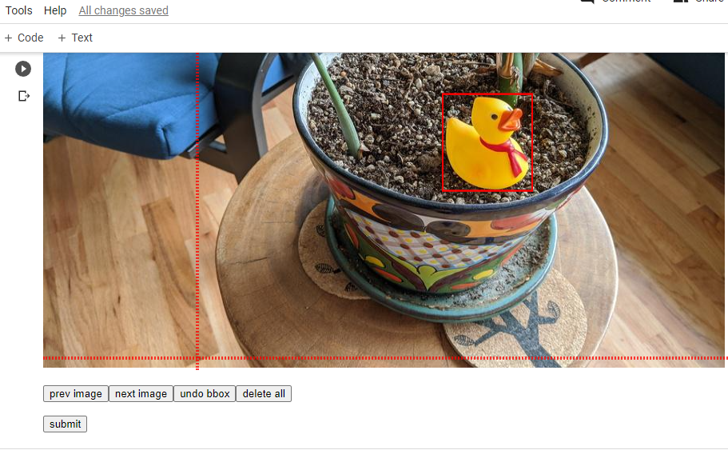

# Interactive Eager Few Shot Od Training Colab

In this repository we demonstrate fine tuning of a (TF2 friendly) RetinaNet architecture on very few examples of a novel class after initializing from a pre-trained COCO checkpoint.

<!--  -->




## Table of Contents


- [Tensorflow Object Detection API](#tensorflow-object-detection-api)
- [Annotating images with bounding boxes](#annotating-images-with-bounding-boxes)
- [Getting Started](#getting-started)
- [Contributing](#contributing)
- [License](#license)


## Tensorflow Object Detection API

The TensorFlow Object Detection API is a powerful framework provided by Google's TensorFlow library for training, deploying, and evaluating object detection models. It simplifies the process of building and deploying custom object detection models using deep learning techniques.

The TensorFlow Object Detection API offers a wide range of pre-trained models such as Faster R-CNN, SSD (Single Shot MultiBox Detector), and EfficientDet, which can be fine-tuned on your own dataset or used directly for inference. These models can detect and localize objects within images or videos and provide bounding box coordinates along with class labels for the detected objects.

Here's a general overview of the workflow using the TensorFlow Object Detection API:

- **Dataset Preparation:** Collect and label a dataset of images or videos with bounding boxes around the objects you want to detect. The dataset needs to be annotated with object classes and their corresponding bounding box coordinates.

- **Configuration:** Define the configuration for your object detection model, specifying parameters such as the model architecture, input image size, learning rate, and number of training steps.

- **Model Training:** Use the labeled dataset and configuration to train your object detection model. During training, the model learns to recognize and localize objects in images by optimizing its parameters based on a loss function.

- **Evaluation:** Evaluate the performance of your trained model using evaluation metrics such as mean Average Precision (mAP) or Precision-Recall curves. This step helps assess the model's accuracy and identify areas for improvement.

- **Model Export:** Export the trained model to a format that can be used for inference on new data. The exported model includes the network architecture, learned weights, and other necessary components.

- **Inference:** Load the exported model and use it to perform object detection on new images or videos. The model will analyze the input data and provide predictions in the form of bounding box coordinates and class labels for the detected objects.

## Annotating images with bounding boxes

We will annotate the rubber duckies using ```colabutils```. we draw a box around the rubber ducky in each image.

Do not forget to ```submit``` when there are no more images to label.




and the output is like this:

```
output:

[array([[0.42273437, 0.58382181, 0.63273437, 0.72098476]]),
 array([[0.53273437, 0.57913247, 0.73773437, 0.7116061 ]]),
 array([[0.45440104, 0.40797186, 0.63106771, 0.55334115]]),
 array([[0.29773437, 0.30011723, 0.64940104, 0.53106682]]),
 array([[0.25106771, 0.43845252, 0.48606771, 0.63071512]])]
```

## Getting Started

To get started with this project, follow these steps:

1. Click this link to open the notebook in Colab: https://colab.research.google.com/github/barzansaeedpour/interactive-eager-few-shot-od-training-colab/blob/main/interactive_eager_few_shot_od_training_colab.ipynb

2. The instruction and explaination of the code is mentioned in the notebook


## Contributing

Contributions to this repository are welcome. If you find any issues or have suggestions for improvements, feel free to open an issue or submit a pull request.


## License

This project is licensed under the [MIT License](LICENSE). Feel free to use and modify the code as per the terms of the license.
